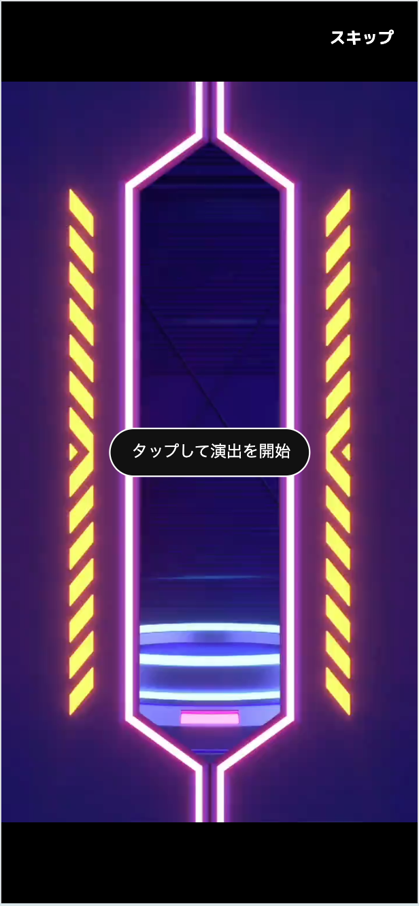
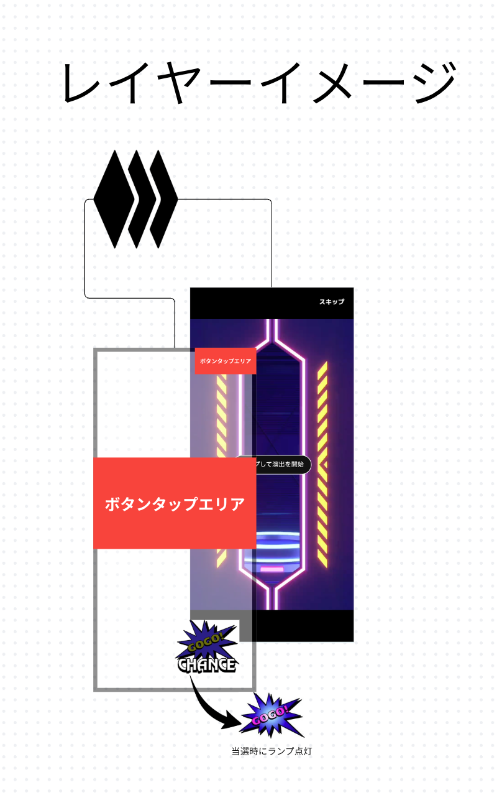

# 01-f. ガチャ演出 裏ボタン（確定音・GOGOランプ）

| 項目 | 内容 |
|------|------|
| クライアント | ノヴァガチャ様 |
| 機能ID | 01-f |
| 種別 | ガチャ演出画面の機能追加 |
| 出典 | 打ち合わせメモ「NOVA様 5月13日 13:00-13:30」 |
| NA | 仕様書作成 → 工数確認（鈴木） ＝ 本書 |
| ステータス | 仕様確定待ち（確定音抽選ロジックは工数次第で要調整） |

---

## 1. 概要

ガチャの **演出画面** に「**裏ボタン**」を追加する。
演出再生中に画面のボタン（タップエリア）を押すと、**当選している場合に確定音が鳴り、GOGOランプが点灯**する。
パチスロの「確定演出」的な、当落をドキドキ示唆する体験を狙う。

参照: 該当演出画面  ／ レイヤーイメージ 

---

## 2. 該当画面と挙動

### 2-1. 該当画面
演出画面（中央ネオンチューブのリール演出。右上「スキップ」、中央「タップして演出を開始」）。

### 2-2. 想定挙動（メモ準拠）
1. 演出が再生される。
2. 画面上にボタン（タップエリア）が出現する（スキップボタンのようなイメージ＝レイヤーイメージの「ボタンタップエリア」）。
3. ボタンをタップする → **当たっている場合は確定音が鳴る**。
4. 同時に **GOGOランプ（CHANCEランプ）が点灯**（マナーモード対策の視覚示唆）。

> 「確定音」＝鳴ったら当選確定の示唆。**ハズレ時は絶対に鳴らない**（誤示唆防止）。

---

## 3. 確認事項への回答・仕様化

メモの確認項目（1〜6）に対する仕様。

### 3-1. ボタンの位置（確認1）
- 演出画面の **中央タップエリア**（透明オーバーレイ）＋ **下部にGOGOランプ**。
- レイヤー構成（レイヤーイメージ準拠）:
  ```
  [最前面] GOGOランプ / CHANCE 点灯演出
  [中間]   ボタンタップエリア（透明・全面 or 中央大）
  [背面]   演出本体（リールアニメーション）＋スキップ
  ```

### 3-2. 出し分け ON/OFF 制御（確認2）
- **ガチャ毎に ON/OFF を制御（必須）**。管理画面のガチャ設定に「裏ボタン演出」トグルを追加。

### 3-3. 確定音の種類（確認3）
- **複数種類の登録に対応**（確定音マスタ＋ガチャ別に使用音を選択）。
- 重要度は高くないため **段階実装可**: フェーズ1=1種類固定、フェーズ2=複数登録・選択（工数次第）。

### 3-4. 確定音が鳴る条件・抽選ロジック（確認4｜★コア・要工数確認）

2層の確率で制御する。

```
【前提】結果は抽選済み（当選賞ランクは確定している）

レイヤーA：対象判定
  - 当選賞ランクが「閾値ランク以上」か（既定=A賞以上、ガチャ別に設定可：SS/S/A/B…）
  - 対象外（閾値未満・ハズレ）→ 確定音は一切鳴らない

レイヤーB：発生抽選
  - 対象の場合、「出現確率 XX%」で今回の演出を“確定音アリ”にアーム（armed）
    例）A賞以上の当選のうち XX% だけ確定音が鳴り得る（鳴る方がレア＝喜び増幅）
  - アーム済みなら、タップ1回ごとに 1/N（例 1/10）の抽選 → 当たればその場で確定音＋ランプ
    → 演出終了までに鳴らなければ不発（“押すたびにドキドキ”を演出）
```

- **honest仕様**: 確定音は当選時のみ。ハズレでは鳴らない（ガセ無し）。
- ガチャ別に **閾値ランク**（XX賞以上）を設定可能（オプション・確認4-2）。
- パラメータ: `出現確率(XX%)`, `タップ毎確率(1/N)` は管理設定。
- **工数注記**: 「タップ毎に1/Nで抽選」は実装可能。固定（アーム時は最初のタップで必ず鳴る）方式に比べ差分は小。詳細は §7。

> 設計選択肢（要確認 §6-A）:
> - 方式①（推奨）: 上記2層（出現確率＋タップ毎抽選）。最もメモの意図に近い。
> - 方式②（簡易）: 対象当選なら最初のタップで必ず確定音（出現確率のみ、タップ抽選なし）。工数最小。

### 3-5. マナーモード対策（確認5）
- 音に気づけないケースに備え、**GOGOランプ（CHANCEランプ）点灯**で視覚示唆。
- 確定音とランプは同時発火（音OFF/消音中でもランプで判別可能）。

### 3-6. マイページ「演出モード設定」（確認6・★）
- マイページに **演出モード設定** を追加し、ユーザーが裏ボタン演出の **ON/OFF** を選べる。
- OFF時はタップエリア・確定音・ランプを出さず、通常演出のみ。

---

## 4. 確定音 判定ロジック（挙動仕様）

確定音の発火ルールは次のとおり（結果＝当落・当選賞ランクは抽選済みであることが前提）。

- **対象判定**: 当選している場合のみ対象。ハズレは一切対象外。さらに当選賞ランクが「閾値ランク以上」のときのみ対象とする（閾値未満も対象外）。
- **発生抽選（アーム）**: 対象の演出について、設定された出現確率で「確定音アリ」の状態にアームする。アームされなかった場合、その演出では確定音は鳴らない。
- **タップ毎の発火**: アーム済みの場合、ボタンのタップ1回ごとに 1/N の確率で抽選し、当たればその場で確定音を再生し、同時にGOGOランプを点灯する。発火するのは1演出につき1回まで。
- **不発**: アーム済みでも、演出終了までにタップ抽選が当たらなければ確定音は鳴らない（「押すたびにドキドキ」を演出）。
- **マナーモード対応**: 確定音とGOGOランプは同時に発火させ、消音中でもランプで判別できるようにする。

- **セキュリティ**: 当落・アーム判定は **サーバ側で確定**し、結果に同梱する（クライアントだけで判定すると当落事前バレ・改ざんの恐れ）。タップ抽選はUX上クライアントでも可だが、アーム情報の秘匿に注意（§6-B）。
- 連続抽選（10連等）の演出での扱いは §6-C。

---

## 5. 画面要件

### 5-1. 演出画面（ユーザー）
- 演出再生中、中央に **タップエリア**（透明・押下可）。
- アーム有無に関わらず見た目は同一（押すまで分からない）。
- 確定音発火時: 確定音再生＋ **GOGOランプ（CHANCE）点灯**（下部スターバースト）。
- 既存「スキップ」は維持。

### 5-2. マイページ
- 「演出モード設定」項目（トグル ON/OFF）。

### 5-3. 管理画面（ガチャ編集）
- 「裏ボタン演出」: ON/OFF トグル。
- 対象賞ランク（プルダウン：SS/S/A/B…の閾値）。
- 出現確率(%)、タップ毎確率(1/N)。
- 確定音選択（複数登録時。フェーズ2）。

---

## 6. 未確定事項

| # | 確認点 | 影響 | 暫定 |
|---|--------|------|------|
| A | 確定音方式①(タップ毎抽選) / ②(初回タップ確定) | 工数・体験 | ①推奨。②は工数最小 |
| B | 当落・アーム判定をサーバ確定にするか | 改ざん耐性 | サーバ確定を強く推奨 |
| C | 10連/100連演出での裏ボタン挙動 | 仕様 | 最上位当選1件を対象に1回判定を想定 |
| D | 確定音 複数種類はフェーズ1で必要か | 工数 | フェーズ2でも可（重要度低） |
| E | GOGOランプの具体ビジュアル/モーション | デザイン | CHANCEスターバースト点灯（レイヤーイメージ準拠） |
| F | 閾値ランクにSS賞（新設予定）を含めるか | 賞ランク追加と連動 | 設定プルダウンにSSを追加 |

---

## 7. 工数概算

| 作業 | 方式①(推奨) | 方式②(簡易) |
|------|------------|------------|
| ガチャ設定拡張・管理UI（ON/OFF・閾値・確率） | 0.5D | 0.5D |
| 演出画面 タップエリア＋確定音再生 | 0.5D | 0.5D |
| GOGOランプ点灯演出 | 0.5D | 0.5D |
| アーム/タップ抽選ロジック（サーバ確定） | 0.5D | 0.3D |
| マイページ 演出モード設定 | 0.3D | 0.3D |
| 確定音マスタ・複数登録（フェーズ2） | +0.7D | +0.7D |
| テスト・QA | 0.5D | 0.5D |
| **合計（フェーズ1）** | **約 2.8D** | **約 2.6D** |

> 確定音の複数種類登録（フェーズ2）込みで +0.7D 程度。

---

## 8. テスト観点
- [ ] ガチャ別 ON/OFF が効く（OFF時はタップエリア・音・ランプなし）
- [ ] ハズレ・閾値未満では確定音が鳴らない
- [ ] 閾値ランク以上の当選で、出現確率通りにアームされる
- [ ] アーム時、タップ毎に1/Nで確定音が発火する（方式①）
- [ ] 確定音発火と同時にGOGOランプが点灯する（マナーモードでも視認可）
- [ ] マイページの演出モードOFFで裏ボタン演出が無効化される
- [ ] 当落・アーム判定がサーバ側で確定（クライアント改ざんで先バレしない）
- [ ] スキップ機能が従来通り動作

---

## 9. 関連メモ（同打ち合わせ・別アジェンダ）
本機能とは別に、同メモに以下が記録（別途仕様化対象）:
- ガチャソート機能（1.5D・条件待ち）
- 課金消費型ガチャのBT消費対応（3D ＝ [01-a](a-bt-consumption-gacha.md)）
- **SS賞ランクの追加**（ガチャ詳細・ギフト登録に波及。01-f の閾値にも関係）
- イベント機能：**紅白チーム分けの山分けイベント** ＝ [01-E](events-platform.md) の `team_battle`（チーム戦）に該当

---

## 10. mock
[../mocks/裏ボタン/機能モック.html](../mocks/裏ボタン/機能モック.html)
